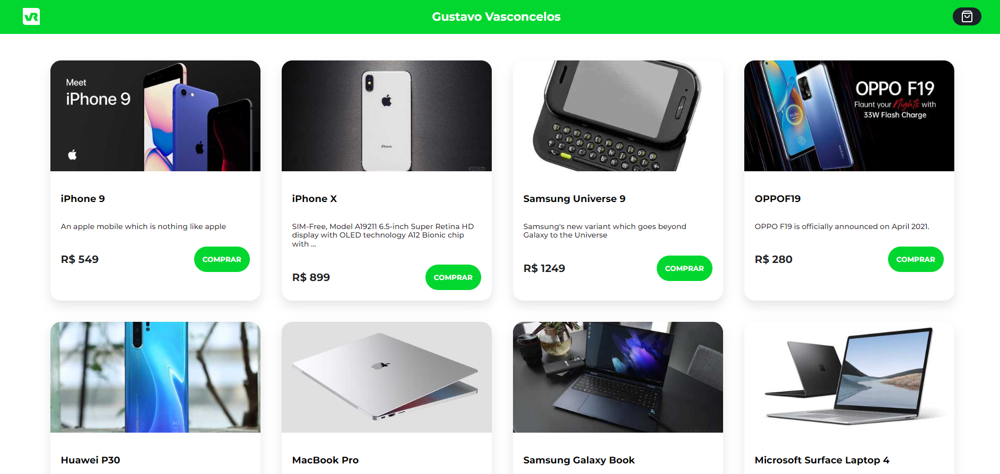
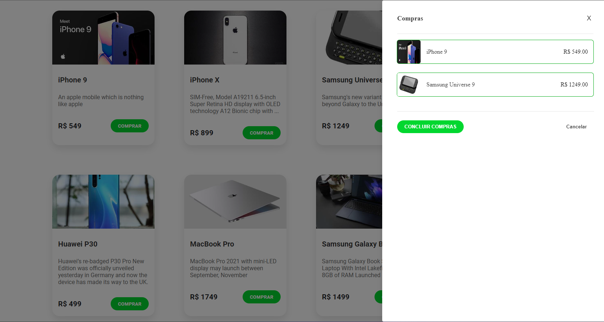
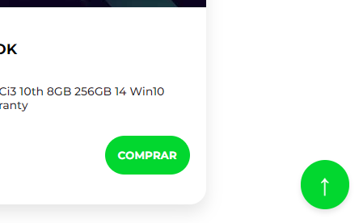

# Microfrontends com Module Federation e React - Gustavo Vasconcelos 🚀

Este projeto demonstra a implementação de uma arquitetura de microfrontends utilizando Module Federation e React, onde `app-central` atua como o host principal e carrega os outros microfrontends.

## 🛠 Tecnologias Implementadas

 -  Uma biblioteca JavaScript para construir interfaces de usuário.
 -  Module Federation: Uma funcionalidade do Webpack que permite um carregamento dinâmico de código entre vários builds de forma independente.
 -  Gerenciador de pacotes utilizado para gerenciar as dependências do projeto.

## 📂 Estrutura do Projeto

O projeto consiste em 4 microfrontends:

- `app-central`: O aplicativo principal que carrega os demais microfrontends.
- `app-header`: O cabeçalho da aplicação, carregado dentro de `app-central`.
- `app-footer`: O rodapé da aplicação, também carregado dentro de `app-central`.
- `app-cards`: A seção que exibe uma lista de cards, carregada dentro de `app-central`.

## 🚀 Instalação e Execução com Lerna

Para instalar e iniciar todos os microfrontends simultaneamente usando Lerna, siga os passos detalhados abaixo. Lerna é uma ferramenta que otimiza o gerenciamento de projetos com múltiplos pacotes, permitindo que você lide com todos eles como se fossem um único projeto.

### Pré-requisitos
Antes de começar, certifique-se de que você tem `Node.js` e `npm` instalados em sua máquina. Lerna será usado para orquestrar os scripts de instalação e execução.

### Passo 1: Clonar o Repositório
Primeiro, clone o repositório do projeto usando o seguinte comando no terminal:
```bash
git clone https://github.com/sasgustav/Microfrontend-react-vr-gustavo-vasconcelos.git
```

### Passo 2: Navegar até o Diretório do Projeto
Depois de clonar o repositório, navegue até o diretório do projeto:
```bash
cd Microfrontend-react-vr-gustavo-vasconcelos
```

### Passo 3: Instalar o Lerna
Se você ainda não tem o Lerna instalado globalmente, você pode instalá-lo usando o npm:
```bash
npm install -g lerna
```

### Passo 4: Instalar Dependências e Vincular Pacotes
Utilize o Lerna para instalar todas as dependências dos microfrontends e vinculá-las corretamente:
```bash
npm install
```

### Passo 5: Iniciar os Microfrontends
Finalmente, inicie todos os microfrontends simultaneamente usando:
```bash
npm start
```

### Passo 6 (Caso seja necessário encerrar os servidores em portas específicas): Parar os Microfrontends

Quando você desejar parar todos os microfrontends, pode utilizar o comando `npm stop` que foi configurado para encerrar os servidores que estão rodando em portas específicas. Este comando irá efetivamente enviar sinais para fechar cada servidor que foi inicializado por seus respectivos scripts de inicialização.

Para executar a parada dos microfrontends, siga os passos abaixo:

1. **Abra o terminal**: Navegue até o diretório raiz do projeto onde o `package.json` está localizado.

2. **Execute o comando de parada**:
   ```bash
   npm stop
   ```
   Este comando utiliza internamente o pacote `kill-port` para encerrar os processos nas portas designadas para cada microfrontend. Os scripts específicos definidos são `stop-central`, `stop-header`, `stop-footer` e `stop-cards`, cada um encarregado de parar o servidor em sua respectiva porta (3000 para o `app-central`, 3001 para o `app-header`, 3002 para o `app-footer`, e 3003 para o `app-cards`).

3. **Verificação**:
   - Após executar o comando, você pode verificar no terminal se alguma mensagem de erro foi exibida indicando que os processos não foram encerrados corretamente.
   - Se tudo ocorreu sem erros, os terminais que estavam executando os microfrontends não devem mais mostrar os servidores em execução.

4. **Reiniciar, se necessário**: Se você precisar reiniciar os microfrontends após pará-los, simplesmente execute novamente o comando `npm start` conforme descrito no Passo 5.

Este processo garante que você mantenha um controle efetivo sobre os recursos do sistema e evite a ocupação de portas que poderiam causar conflitos no futuro. Além disso, garante que as alterações feitas no código sejam recarregadas corretamente ao reiniciar os microfrontends.

Este comando irá executar o script `start` definido no `package.json`, que utiliza o Lerna para iniciar todos os serviços definidos nos pacotes individualmente, cada um em sua própria porta.

## 🌐 URLs dos Microfrontends
Após iniciar os serviços, os microfrontends estarão disponíveis nas seguintes URLs, acessíveis via navegador:
- `app-central`: [http://localhost:3000](http://localhost:3000)
- `app-header`: [http://localhost:3001](http://localhost:3001)
- `app-footer`: [http://localhost:3002](http://localhost:3002)
- `app-cards`: [http://localhost:3003](http://localhost:3003)

Cada microfrontend carrega componentes específicos, todos hospedados e interagindo através do host `app-central`.

Essas instruções detalham cada etapa, garantindo que o usuário tenha todas as informações necessárias para configurar e executar o projeto com sucesso.

## 🧪 Testes

Para testar a integração dos microfrontends, acesse `app-central` e verifique se os outros estão sendo corretamente carregados e renderizados.

## app-central:


## app-header:


## app-footer:


## app-cards:

### componente de modal:

### componente de voltar ao topo:


---
#### 💻 Desenvolvido por: 🐙[Gustavo Vasconcelos](https://github.com/sasgustav)
#### 👤 LinkedIn: 🔗[Gustavo Vasconcelos](https://www.linkedin.com/in/gustavo-vasconcelos-software-engineer/)
