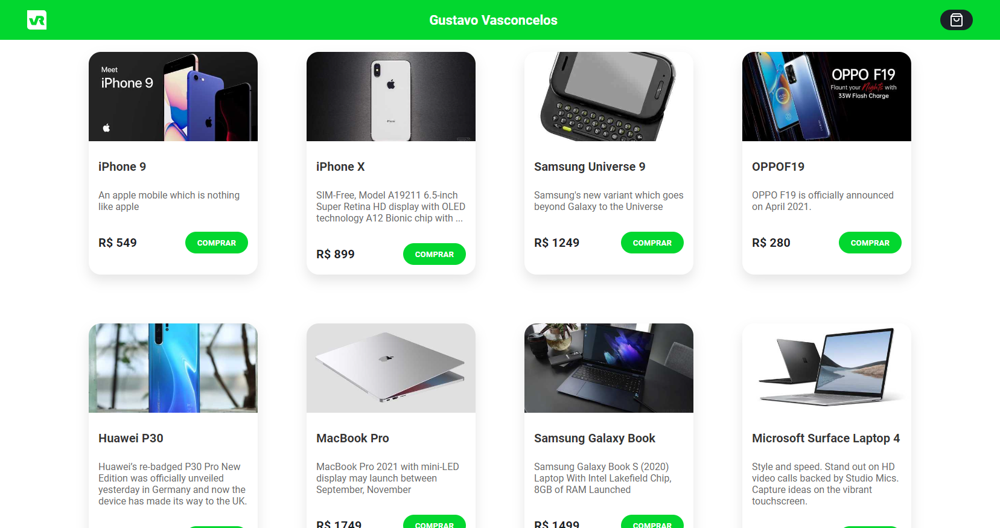
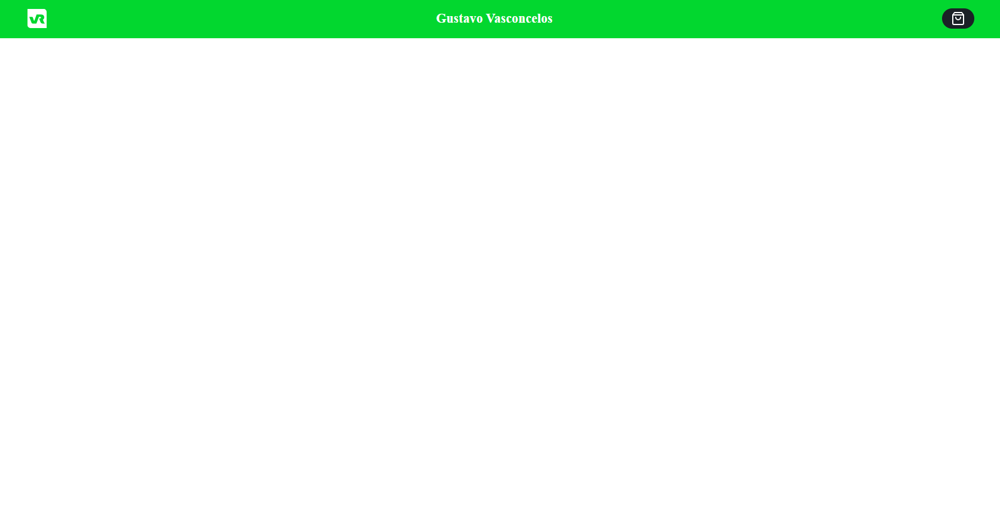
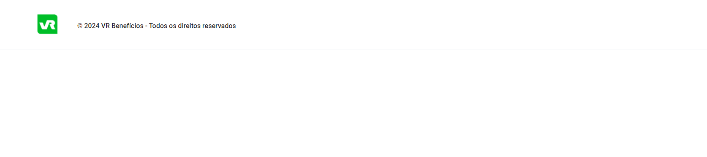
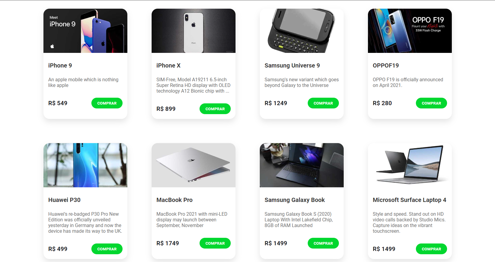
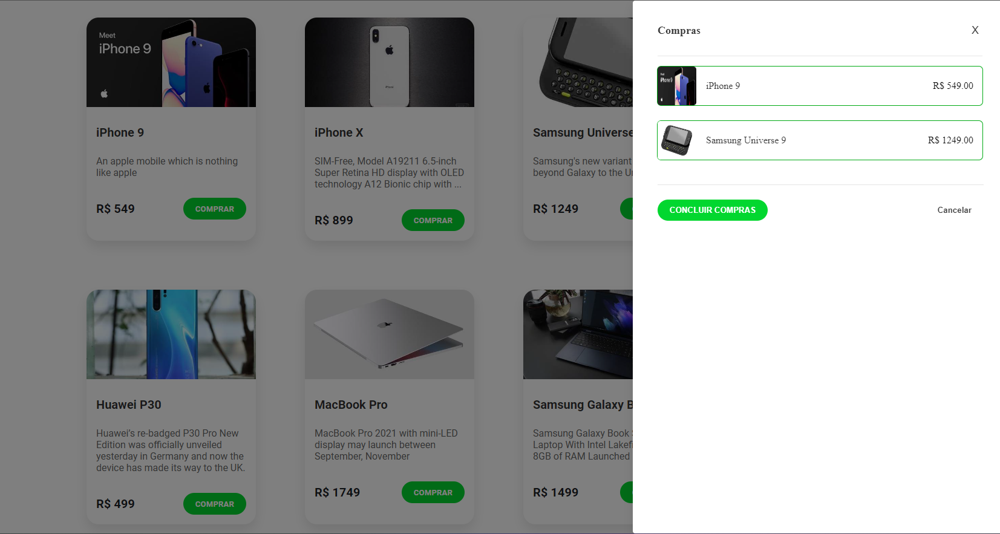

# Microfrontends com Module Federation e React - Gustavo Vasconcelos 🚀

Este projeto demonstra a implementação de uma arquitetura de microfrontends utilizando Module Federation e React, onde `app-central` atua como o host principal e carrega os outros microfrontends.

## 🛠 Tecnologias Implementadas

 -  Uma biblioteca JavaScript para construir interfaces de usuário.
 -  Module Federation: Uma funcionalidade do Webpack que permite um carregamento dinâmico de código entre vários builds de forma independente.
 -  Gerenciador de pacotes utilizado para gerenciar as dependências do projeto.

## 📂 Estrutura do Projeto

O projeto consiste em 4 microfrontends:

- `app-central`: O aplicativo principal que carrega os demais microfrontends.
- `app-header`: O cabeçalho da aplicação, carregado dentro de `app-central`.
- `app-footer`: O rodapé da aplicação, também carregado dentro de `app-central`.
- `app-cards`: A seção que exibe uma lista de cards, carregada dentro de `app-central`.

Para tornar o processo de instalação e execução com o Lerna mais claro e detalhado, você pode ajustar a seção do seu README da seguinte forma:

## 🚀 Instalação e Execução com Lerna

Para instalar e iniciar todos os microfrontends simultaneamente usando Lerna, siga os passos detalhados abaixo. Lerna é uma ferramenta que otimiza o gerenciamento de projetos com múltiplos pacotes, permitindo que você lide com todos eles como se fossem um único projeto.

### Pré-requisitos
Antes de começar, certifique-se de que você tem `Node.js` e `npm` instalados em sua máquina. Lerna será usado para orquestrar os scripts de instalação e execução.

### Passo 1: Clonar o Repositório
Primeiro, clone o repositório do projeto usando o seguinte comando no terminal:
```bash
git clone https://github.com/sasgustav/Microfrontend-react-vr-gustavo-vasconcelos.git
```

### Passo 2: Navegar até o Diretório do Projeto
Depois de clonar o repositório, navegue até o diretório do projeto:
```bash
cd Microfrontend-react-vr-gustavo-vasconcelos
```

### Passo 3: Instalar o Lerna
Se você ainda não tem o Lerna instalado globalmente, você pode instalá-lo usando o npm:
```bash
npm install -g lerna
```

### Passo 4: Instalar Dependências e Vincular Pacotes
Utilize o Lerna para instalar todas as dependências dos microfrontends e vinculá-las corretamente:
```bash
lerna bootstrap
```

### Passo 5: Iniciar os Microfrontends
Finalmente, inicie todos os microfrontends simultaneamente usando:
```bash
npm start
```
Este comando irá executar o script `start` definido no `package.json`, que utiliza o Lerna para iniciar todos os serviços definidos nos pacotes individualmente, cada um em sua própria porta.

### URLs dos Microfrontends
Após iniciar os serviços, os microfrontends estarão disponíveis nas seguintes URLs, acessíveis via navegador:
- `app-central`: [http://localhost:3000](http://localhost:3000)
- `app-header`: [http://localhost:3001](http://localhost:3001)
- `app-footer`: [http://localhost:3002](http://localhost:3002)
- `app-cards`: [http://localhost:3003](http://localhost:3003)

Cada microfrontend carrega componentes específicos, todos hospedados e interagindo através do host `app-central`.
```
Essas instruções detalham cada etapa, garantindo que o usuário tenha todas as informações necessárias para configurar e executar o projeto com sucesso.

## 🌐 URLs dos Microfrontends

- `app-central`: [http://localhost:3000](http://localhost:3000)
- `app-header`: [http://localhost:3001](http://localhost:3001)
- `app-footer`: [http://localhost:3002](http://localhost:3002)
- `app-cards`: [http://localhost:3003](http://localhost:3003)

## 🧪 Testes

Para testar a integração dos microfrontends, acesse `app-central` e verifique se os outros estão sendo corretamente carregados e renderizados.

---

## app-central:


## app-header:


## app-footer:


## app-cards:

### componente de modal:


---
💻 Desenvolvido por [Gustavo Vasconcelos](https://github.com/sasgustav)